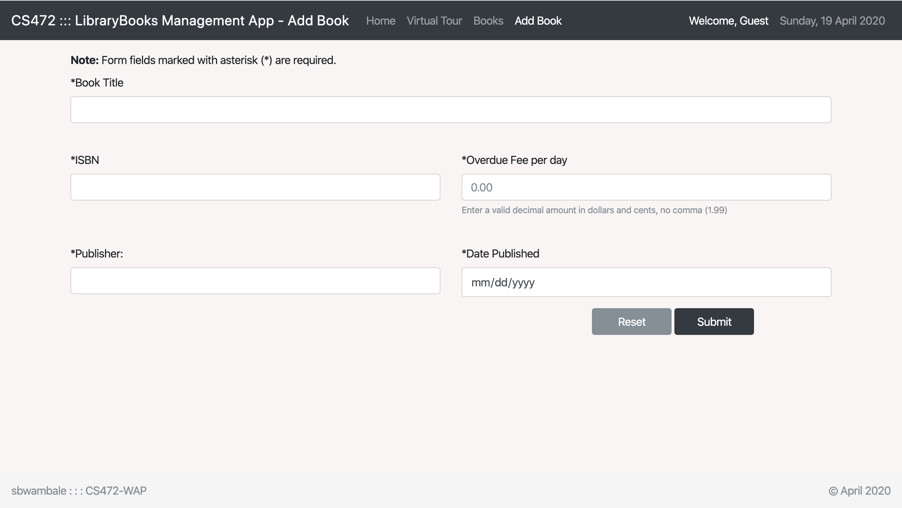
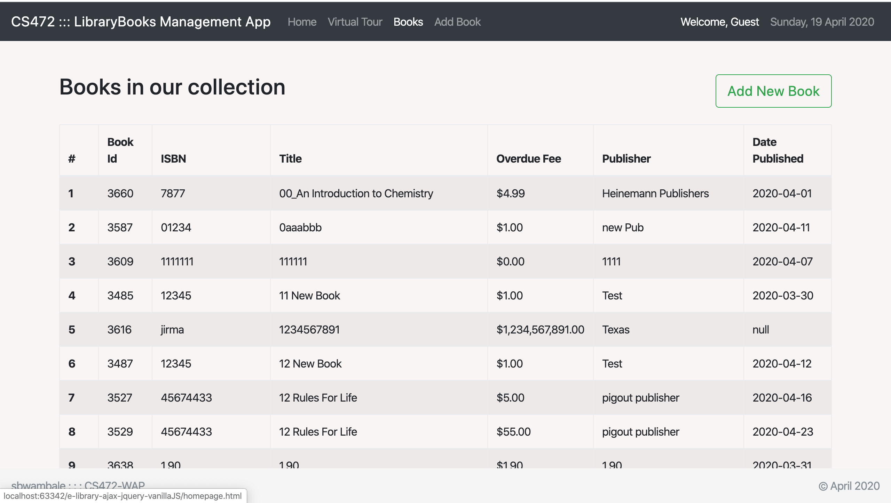

## E-Library

#### Description
This is a library management app that enables the library administrator to easily view all books in the library and addnew books. The app is built using plain JavaScript, JQuery library using AJAX to make calls to RESTful API.

### RESTful services

POST a book to `https://elibraryrestapi.herokuapp.com/elibrary/api/book/add`

GET all books at `https://elibraryrestapi.herokuapp.com/elibrary/api/book/list`

#### To run the app
Clone the repo and launch the homepage using a liveserver or localhost. To view all books in the library click on the `Books` nav menu. To add a new book, click `Add book` nav menu and fill in the new book details.

